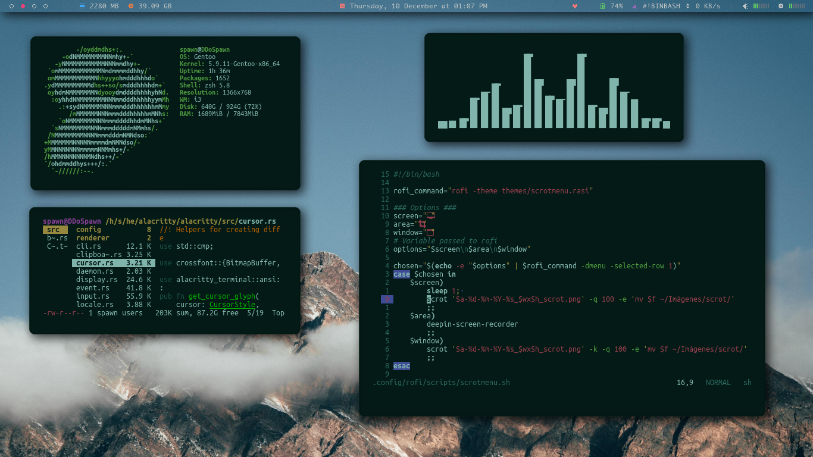
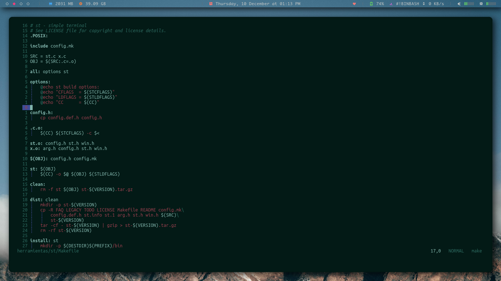

# [i3](https://wiki.archlinux.org/index.php/i3) Configurations by [@spawnmc](https://t.me/spawnmc)

### [i3](http://i3wm.org/) is a dynamic [tiling window manager](https://en.wikipedia.org/wiki/Tiling_window_manager) inspired by wmii that is primarily targeted at developers and advanced users.

## Screenshot

